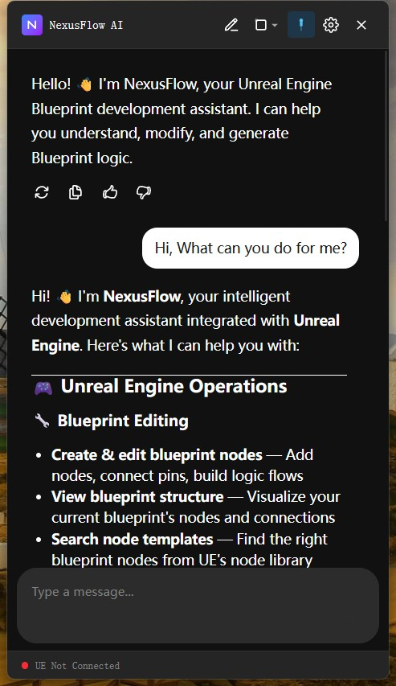

# NexusFlow

**AI-Powered Blueprint Development Assistant for Unreal Engine**

Control UE Blueprints with natural language — understand, modify, and generate in one conversation.

[Download Latest](https://github.com/maxzhao/NexusFlow/releases) · [Report Issue](https://github.com/maxzhao/NexusFlow/issues) · [中文文档](README.cn.md)

---

## ✨ What is NexusFlow

NexusFlow is an AI-assisted development tool deeply integrated with the Unreal Engine Editor. Through a desktop app + UE plugin combo, you can talk to AI in natural language to operate Blueprints, dramatically boosting your development productivity.

**No need to memorize node names. No need to hunt through tangled Blueprint wires — just tell the AI what you want, and it gets it done.**

## 🎯 Key Features

### 🗣️ Natural Language Blueprint Control

- **Understand** — "What does this Blueprint do? Explain the EventGraph logic."
- **Modify** — "Change the character move speed from 600 to 800 and add a sprint feature."
- **Generate** — "Create an Actor Blueprint that restores health when an item is picked up."

### 🧠 Smart Search

Built-in RAG semantic search engine — the AI automatically searches node templates and Blueprint assets without you looking through docs.

### ⚡ Deep UE Editor Integration

- **Right-click Quick Menu** — Right-click in the Blueprint Editor to let AI explain, refactor, or fix
- **Floating Ball** — Quick access to AI chat anytime
- **Sidebar Docking** — Embeds into the editor like a native panel

### 🔧 Extensible Skills System

Python-based capability packs covering Blueprints, assets, lighting, and more — with support for custom extensions.

## 📦 Installation

### System Requirements

| Requirement | Details |
|-------------|---------|
| OS | Windows 10/11 (64-bit) |
| Unreal Engine | 5.3 – 5.7 |
| LLM API | OpenAI / Anthropic / DeepSeek (bring your own API Key) |

### Steps

1. **Download** — Get the latest installer from [Releases](https://github.com/maxzhao/NexusFlow/releases)
2. **Install UE Plugin** — The setup wizard will guide you through plugin installation on first launch
3. **Configure AI Model** — Enter your LLM API Key in Settings
4. **Start Using** — Open a UE project, click the floating ball or use the hotkey to start chatting

## 🌍 Language Support

- 🇺🇸 English
- 🇨🇳 简体中文
- 🇹🇼 繁體中文

## 📋 Version Status

| Phase | Version | Status |
|-------|---------|--------|
| MVP | 0.1.0 | ✅ Complete |
| **Beta** | **0.5.0** | **🔄 In Development** |
| Release | 1.0.0 | 📋 Planned |

Currently in **Beta** — core features are functional, and we're actively improving the user experience.

## ❓ FAQ

**Q: Does it require internet?**
A: Yes. NexusFlow calls LLM APIs (OpenAI / Anthropic / DeepSeek) to provide AI capabilities. A stable internet connection is required.

**Q: Which LLMs are supported?**
A: OpenAI, Anthropic (Claude), and DeepSeek. You need to provide your own API Key.

**Q: Does it support macOS?**
A: Currently Windows only. macOS support is planned for the Release 1.0 version.

**Q: Will it modify my UE project files?**
A: All Blueprint operations use UE's native Undo system (FScopedTransaction). Every change can be undone with Ctrl+Z.

## 📬 Feedback

Found a bug or have a suggestion? We'd love to hear from you:

- [GitHub Issues](https://github.com/maxzhao/NexusFlow/issues) — Bug reports & feature requests

## 📄 License

NexusFlow Proprietary Freeware License

Copyright © 2026 NexusFlow. All rights reserved.

This software is free to use and distribute, but **may not be modified, reverse-engineered, decompiled, or sold**. See [LICENSE](LICENSE) for details.
